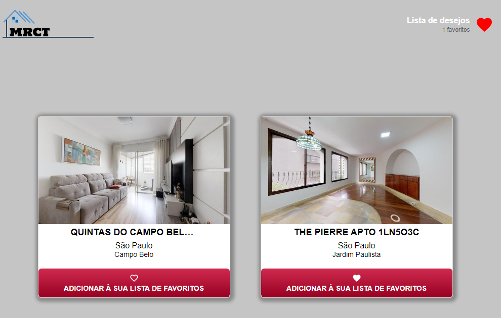

# Interface-mrct
 Órulo challenge

# :computer: Built With
_This project was developed with the following technologies:_

* [React](https://reactjs.org/)
* [Axios](https://github.com/axios/axios)
* Redux
* [styled-components](https://styled-components.com/)
* [Órulo api](http://api.orulo.com.br.s3-website-us-east-1.amazonaws.com/)
* [VS Code](https://code.visualstudio.com/) with [EditorConfig](https://marketplace.visualstudio.com/items?itemName=EditorConfig.EditorConfig) and [ESLint](https://marketplace.visualstudio.com/items?itemName=dbaeumer.vscode-eslint)/[Prettier](https://prettier.io/)

# :information_source: Getting Started

### Prerequisites

To clone and run this application, you'll need [Git](https://git-scm.com/), [Node.js](https://nodejs.org/en/) v10.16 or higher + [Yarn](https://yarnpkg.com/) v1.13 or higher installed on your machine. From your command line:

```
Clone this repository
git clone https://github.com/cbsalt/interface-mrct.git

Go into the repository

Install dependencies
yarn install

Run the app
Create a file .env.local and add your Órulo buildings token
yarn start
```

## :dart: Screens




